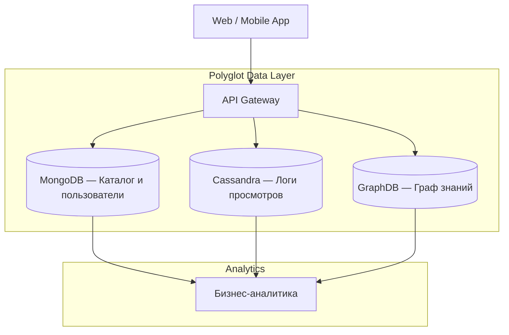

# Отчет по Практической работе №2  
## Изучение и применение различных типов NoSQL баз данных на бизнес-кейсах (Polyglot Persistence)

**Студент:** Трусов Артемий Ильич  
**Группа:** 251м
**Вариант:** 29  

---

## 1. Введение. Описание бизнес-кейса и архитектуры

### 1.1 Бизнес-кейс

Цель работы — разработка аналитического ядра для стриминговой платформы (аналог Netflix/Кинопоиск) с использованием подхода **Polyglot Persistence** — применения нескольких специализированных СУБД для разных типов данных.

В рамках платформы необходимо хранить:

- каталог фильмов и пользователей  
- потоковые логи действий пользователей  
- граф связей между фильмами, актёрами и жанрами  
- данные для рекомендательной системы  

Использование одной реляционной БД для всех задач неэффективно, поэтому применяются разные NoSQL решения.

### 1.2 Выбранный стек технологий

**MongoDB (Document Store)**  
Используется для хранения профилей пользователей и метаданных контента. Подходит благодаря:

- гибкой схеме (JSON/BSON)
- поддержке геопространственных данных
- высокой скорости разработки

**Cassandra (Wide-Column Store)**  
Предназначена для хранения логов просмотров:

- высокая скорость записи
- горизонтальная масштабируемость
- устойчивость к отказам

**GraphDB (RDF Graph Database)**  
Используется для анализа связей:

- актёр — фильм — жанр
- построение рекомендаций
- сложные аналитические запросы (SPARQL)

---

### 1.3 Архитектура решения



---

## 2. Развертывание инфраструктуры

Контейнеры запущены на виртуальной машине devops_dba_25.ova.

```bash
# MongoDB
cd ~/Downloads/dba/nonrel/mongo
sudo docker compose up -d

# Cassandra
cd ~/Downloads/dba/nonrel/cassandra
sudo docker compose up -d

# GraphDB
cd ~/Downloads/dba/nonrel/graphdb
sudo docker compose up -d
```

Проверена доступность веб‑интерфейсов:

- Mongo Express  
- Cassandra Web  
- GraphDB Workbench  
(!containers)[https://github.com/trusov13/DEP-MGPU-BigDataWork/blob/main/pw_02/containers.png]
---

## 3. Выполнение задания 1 — MongoDB

### Геопространственный поиск пользователей ($near)

Задача: найти пользователей, находящихся рядом с заданной точкой.

### 3.1 Подготовка данных

```js
use streaming_db

db.users.insertMany([
  {
    name: "Ivan",
    location: {
      type: "Point",
      coordinates: [37.6176, 55.7558]
    }
  },
  {
    name: "Anna",
    location: {
      type: "Point",
      coordinates: [30.3351, 59.9343]
    }
  },
  {
    name: "Petr",
    location: {
      type: "Point",
      coordinates: [37.6, 55.75]
    }
  }
])
```

Создание геопространственного индекса:

```js
db.users.createIndex({ location: "2dsphere" })
```

### 3.2 Выполнение запроса

Поиск пользователей в радиусе 50 км:

```js
db.users.find({
  location: {
    $near: {
      $geometry: {
        type: "Point",
        coordinates: [37.6176, 55.7558]
      },
      $maxDistance: 50000
    }
  }
})
```

### 3.3 Обоснование

MongoDB эффективно работает с геоданными благодаря встроенной поддержке GeoJSON и индексам 2dsphere.

Практическое применение:

- рекомендации локального контента  
- анализ региональной аудитории  
- геотаргетинг рекламы  
- подбор событий рядом с пользователем  

---

## 4. Выполнение задания 2 — GraphDB (SPARQL)

### Условие

Найти:

1. Фильмы с рейтингом < 5.0, но более 500 комментариев  
2. Драмы до 1990 года с рейтингом > 7.0  

### 4.1 Запрос 1 — низкий рейтинг, высокая обсуждаемость

```sparql
PREFIX ex: <http://example.org/movie#>

SELECT ?movie ?title ?rating ?comments
WHERE {
  ?movie ex:title ?title ;
         ex:rating ?rating ;
         ex:comments ?comments .

  FILTER (?rating < 5.0 && ?comments > 500)
}
```

### 4.2 Запрос 2 — старые драмы с высоким рейтингом

```sparql
PREFIX ex: <http://example.org/movie#>

SELECT ?movie ?title ?rating ?year
WHERE {
  ?movie ex:title ?title ;
         ex:rating ?rating ;
         ex:year ?year ;
         ex:genre "Drama" .

  FILTER (?year < 1990 && ?rating > 7.0)
}
```

### 4.3 Обоснование

GraphDB позволяет выполнять сложные аналитические запросы по связанным данным без громоздких JOIN‑операций.

---

## 5. Выполнение задания 3 — Бизнес‑аналитика

### Тема

Феномен «так плохо, что даже хорошо»: фильмы с низким рейтингом, но высокой обсуждаемостью.

### 5.1 Анализ явления

Причины высокой популярности плохих фильмов:

- вирусный эффект и мемы  
- скандалы вокруг фильма  
- культовый статус  
- участие известных актёров  
- необычный или абсурдный сюжет  
- ностальгия  

Такие фильмы вызывают активные обсуждения, несмотря на низкие оценки.

### 5.2 Бизнес‑ценность

Для стриминговой платформы подобный контент может быть выгоден:

- увеличивает вовлечённость пользователей  
- повышает время просмотра  
- стимулирует обсуждение в соцсетях  
- привлекает новую аудиторию  

### 5.3 Рекомендации

1. Создать подборки «Культовое плохое кино»  
2. Использовать такие фильмы для привлечения внимания  
3. Продвигать их через алгоритмы рекомендаций  
4. Учитывать обсуждаемость как отдельную метрику успеха  

---

## 6. Итоговые выводы

В ходе работы подтверждена эффективность подхода Polyglot Persistence.

**MongoDB** — удобна для хранения гибких данных и геопространственного анализа.  
**Cassandra** — оптимальна для потоковых логов и больших объёмов записи.  
**GraphDB** — незаменима для анализа связей и построения рекомендаций.

Использование нескольких специализированных СУБД позволяет создать масштабируемую и производительную систему аналитики для стриминговой платформы.
